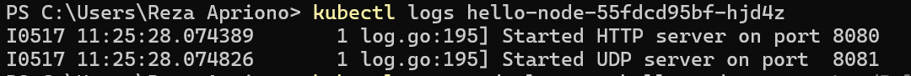

# Hello-Minikube

1. Compare the application logs before and after you exposed it as a Service. Try to open the app several times while the proxy into the Service is running. What do you see in the logs? Does the number of logs increase each time you open the app?

Ketika melakukan pengecekan log, terdapat perbedaan output antara sebelum dan sesudah service di expose. Service dapat menerima get request setelah terexpose, sehingga pada log akan tercatat request-request yang pernah terbuat. Setiap kali melakukan refresh terhadap service hello-node, maka get request yang tercatat di log akan bertambah.

2. Notice that there are two versions of kubectl get invocation during this tutorial section. The first does not have any option, while the latter has -n option with value set to kube-system. What is the purpose of the -n option and why did the output not list the pods/services that you explicitly created?

Option -n pada perintah kubectl digunakan untuk menyatakan namespace tertentu pada cluster Kubernetes. Hal ini diperlukan jika misal terdapat banyak service berbeda yang memiliki nama yang sama dan tersebar di banyak namespace, sehingga kita bisa memisahkan objek dalam kluster agar resourcenya lebih terorganisir. Output tidak menampilkan pods/services secara eksplisit disebabkan karena resource tersebut dibuat pada namespace lain.

# Rolling Update & Kubernetes Manifest File
1. What is the difference between Rolling Update and Recreate deployment strategy?

- Strategi Recreate mengambil pendekatan yang sederhana untuk pembaruan. Strategi ini terdiri dari mematikan versi A kemudian menerapkan versi B setelah versi A dimatikan. Ada sedikit downtime selama transisi yang memungkinkan versi yang diperbarui mengambil tempatnya.

- Strategi Rolling Update memungkinkan pembaruan Deployment berlangsung tanpa downtime. Strategi ini memastikan transisi yang lancar dan berkelanjutan, mengurangi downtime dengan menjaga sejumlah instance yang sehat sepanjang proses pembaruan.

2. Try deploying the Spring Petclinic REST using Recreate deployment strategy and document your attempt.

Untuk menerapkan strategi Recreate, pertama saya menjalankan kubectl edit deployments spring-petclinic-rest kemudian mengedit versi dari file teks yang keluar. Kemudian, secara otomatis kubernetes akan menerapkan Recreate deployment strategy.

3. Prepare different manifest files for executing Recreate deployment strategy.

File tersebut sudah saya lampirkan pada repository ini dengan nama deploymentrecreate.yaml.

4. What do you think are the benefits of using Kubernetes manifest files? Recall your experience in deploying the app manually and compare it to your experience when deploying the same app by applying the manifest files (i.e., invoking kubectl apply -f command) to the cluster.

- Dapat Mendefinisikan keadaan yang diinginkan dari setiap objek Kubernetes dalam kluster.
- Dapat mengelola objek secara deklaratif, yang berarti mendefinisikan keadaan yang diinginkan dan Kubernetes akan melakukan tindakan yang diperlukan untuk mencapai keadaan tersebut.
- Dengan menggunakan file manifest, versi konfigurasi dapat dilakukan bersama dengan kode, kemudian diterapkan ke kluster secara deklaratif.
- Dapat dengan mudah mengelola pembaruan kolaboratif ke objek Kubernetes.
- Proses manajemen infrastruktur yang lebih efisien dan tahan terhadap kesalahan.