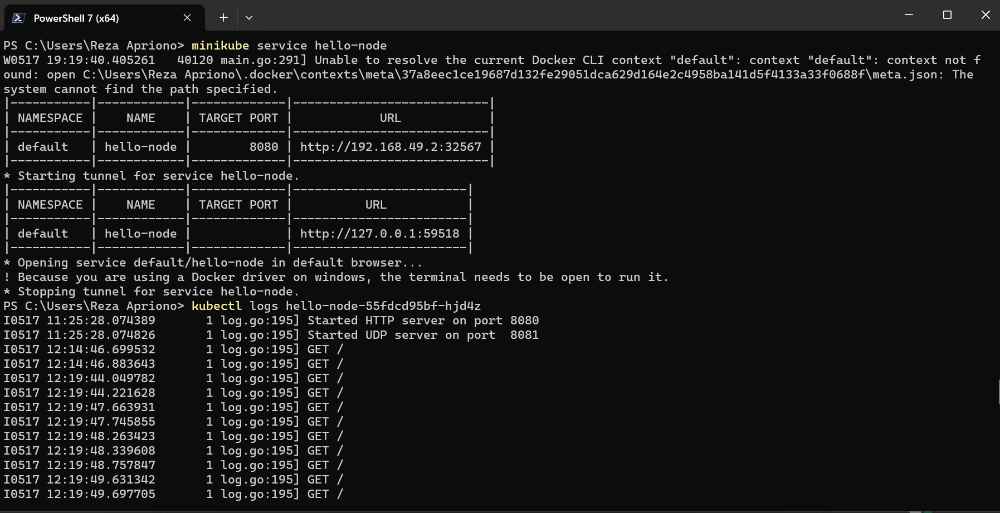

# Hello-Minikube

1. Compare the application logs before and after you exposed it as a Service. Try to open the app several times while the proxy into the Service is running. What do you see in the logs? Does the number of logs increase each time you open the app?

Ketika melakukan pengecekan log, terdapat perbedaan output antara sebelum dan sesudah service di expose. Service dapat menerima get request setelah terexpose, sehingga pada log akan tercatat request-request yang pernah terbuat. Setiap kali melakukan refresh terhadap service hello-node, maka get request yang tercatat di log akan bertambah.

2. Notice that there are two versions of kubectl get invocation during this tutorial section. The first does not have any option, while the latter has -n option with value set to kube-system. What is the purpose of the -n option and why did the output not list the pods/services that you explicitly created?

Option -n pada perintah kubectl digunakan untuk menyatakan namespace tertentu pada cluster Kubernetes. Hal ini diperlukan jika misal terdapat banyak service berbeda yang memiliki nama yang sama dan tersebar di banyak namespace, sehingga kita bisa memisahkan objek dalam kluster agar resourcenya lebih terorganisir. Output tidak menampilkan pods/services secara eksplisit disebabkan karena resource tersebut dibuat pada namespace lain.